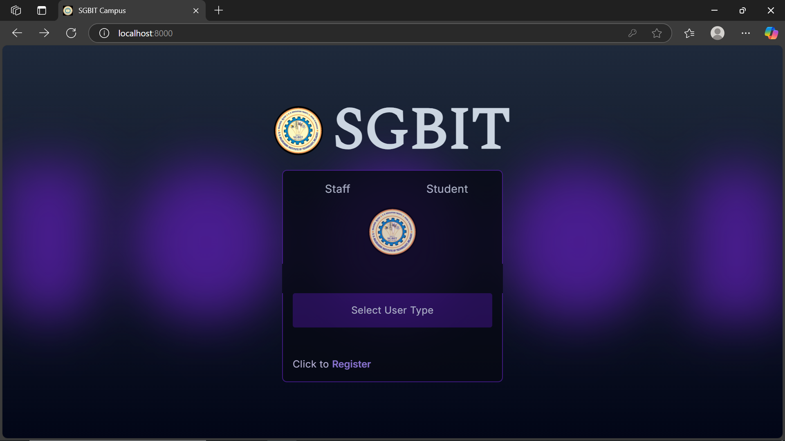
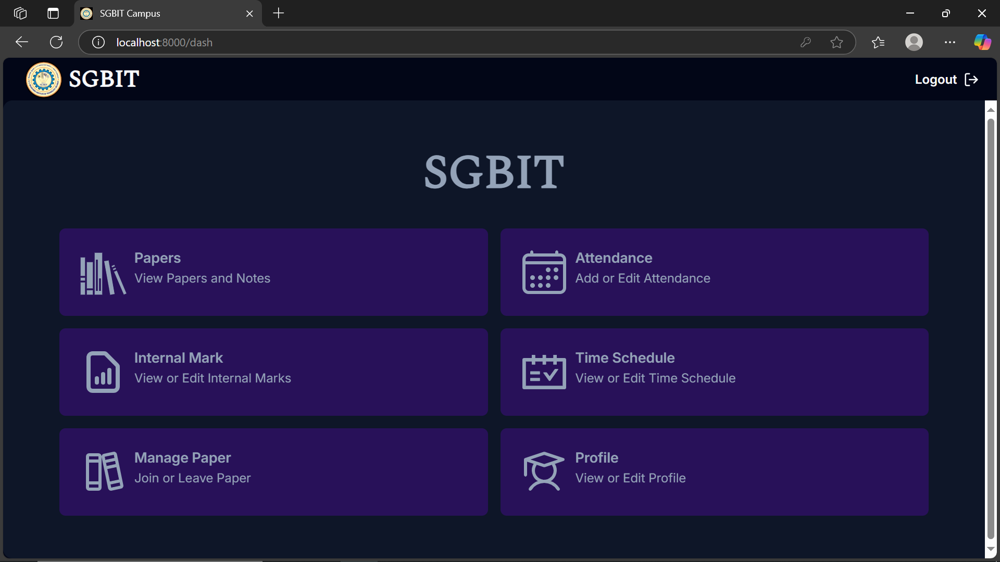
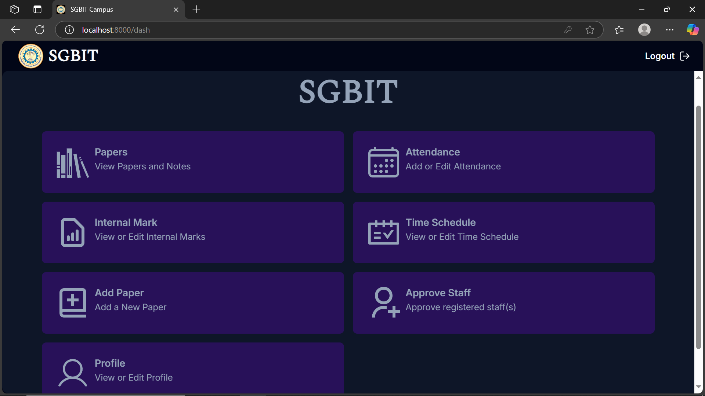
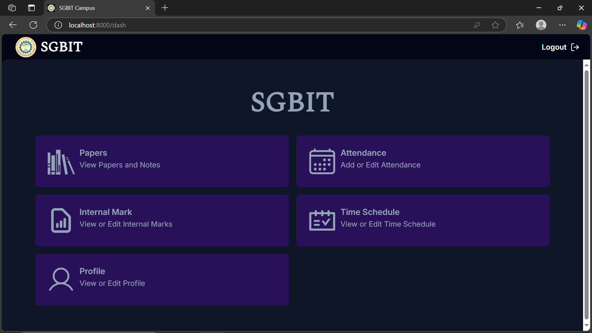

# ERP Portal for SGBIT 🎓

## Demo 🎥
[](./assets/demo.mp4)  
(*Click the image to view the demo video.*)

---

## Overview 📋
The **ERP Portal** is a comprehensive data management system tailored for academic institutions. Designed to enhance administrative efficiency and the student learning experience, the portal offers **role-based access** for Teachers, HODs, and Students. With features like attendance tracking, internal marks management, and time schedule handling, it serves as a centralized hub for academic workflows.

---

## Features ✨
### **1. Teacher Role:**
- Add and manage:
  - **Notes**
  - **Attendance**
  - **Internal Marks**
  - **Time Schedules**

### **2. HOD Role:**
- All functionalities available to Teachers.
- Additional features:
  - Approve new Teachers.
  - Add new Papers (Subjects).

### **3. Student Role:**
- View:
  - **Notes**
  - **Attendance**
  - **Internal Marks**
- Enroll or withdraw from Papers (Subjects).

---

## Technology Stack 🛠️
- **Frontend:** React.js, TailwindCSS
- **Backend:** Node.js, Express.js
- **Database:** MongoDB

---

## Screenshots 📸
#### **Main Portal**


#### **Student Dashboard**


#### **HOD Dashboard**


#### **Teacher Dashboard**


---

## Setup Instructions 🚀
### Prerequisites
- Node.js (v14+)
- MongoDB (local or cloud instance)

### Steps
1. **Clone the Repository:**
   ```bash
   git clone https://github.com/your-username/ERP-Portal.git
   cd ERP-Portal
2. **Install Dependencies:**
   ```bash
   npm install
3. ### Setup Environment Variables
To run the ERP Portal, create a `.env` file in the server-side root directory. This file will store sensitive configuration details needed for the application to interact with its database securely.

#### Example `.env` File Content:
```plaintext
DATABASE_URI=<your_mongodb_connection_string>
```
4. ### Run the Application:
   ```bash
   npm start
5. ### Access the Application:
  - Open your browser and navigate to http://localhost:5000.

### Purpose 🏆

This project demonstrates:
- **Proficiency in full-stack web development.**
- **Skills in frontend frameworks, backend APIs, and database integration.**
- **The ability to build modular, scalable, and efficient systems for real-world use cases.**

### Contact 📬

For queries or collaboration:
- **Name:** Sangamesh Karadagi  
- **Email:** [saish.v.karadagi@gmail.com](mailto:saish.v.karadagi@gmail.com)  
- **LinkedIn:** [linkedin.com/in/sangamesh-karadagi](https://linkedin.com/in/sangamesh-karadagi)

 

   
